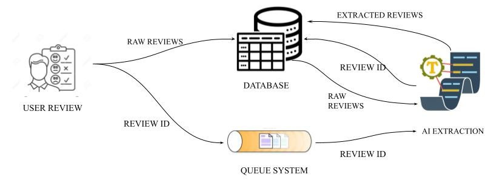

# 🧠 AI-Powered Customer Review Insights

## 📌 Overview
E-commerce platforms receive thousands of customer reviews daily.  
These reviews contain valuable feedback about:
- Product quality
- Delivery experience
- App functionality
- Support responsiveness

Manually analyzing them is **time-consuming, error-prone, and unscalable**.  

This project transforms **unstructured customer reviews** into **structured, machine-readable insights** using **LLM-powered extraction (OpenRouter GPT API)**.  
These insights can power dashboards for **Product** and **Operations teams**, enabling faster decisions.

---

## 🎯 Features
- Extracts **structured insights** from free-text reviews:
  - ✅ Metadata (review_id, date, rating)
  - 😀 Overall sentiment
  - 🏷️ Topics mentioned (delivery, UI, support, pricing, etc.)
  - 👍 Positive opinions
  - 👎 Negative opinions
  - 📉 Problems raised
  - 💡 Suggestions for improvement
- Outputs in **valid JSON** schema (machine-readable)
- Works on **single reviews** or **batch of reviews (JSON/CSV)**
- Ready for visualization (Streamlit / BI tools)

---

## 🏗️ Architecture

  

1. User Review → Customers submit raw reviews through the application.

2. Database → All incoming reviews are stored in the database along with their review_id.

3. Queue System → The review_id is also sent to a queue system to ensure asynchronous and reliable     processing.

4. AI Extraction → The AI module fetches raw reviews from the database using the review_id, processes them, and extracts structured insights (sentiment, problems, suggestions, etc.).

5. Extracted Reviews → Structured insights are written back into the database and made available for downstream dashboards and analytics.

---

## ⚙️ Setup Instructions

---