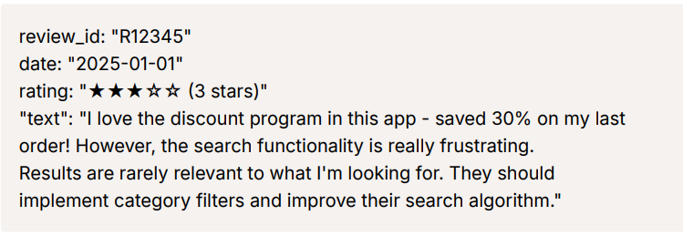
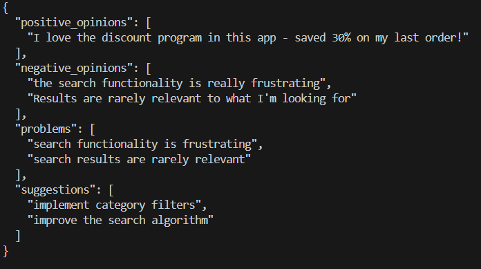
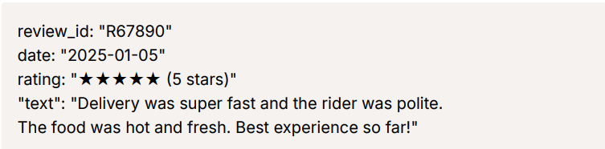
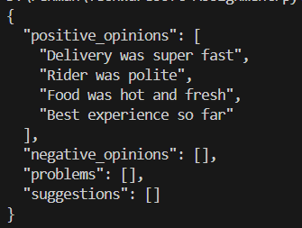
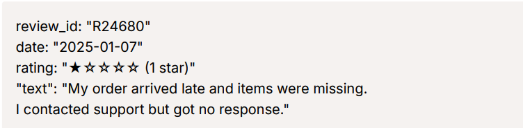
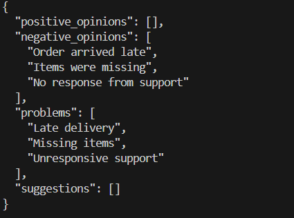
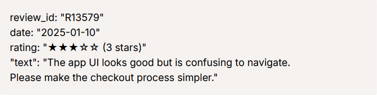
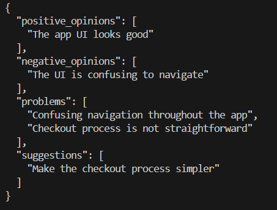

# 🧠 AI-Powered Customer Review Insights

## 📌 Overview
E-commerce platforms receive thousands of customer reviews daily.  
These reviews contain valuable feedback about:
- Product quality
- Delivery experience
- App functionality
- Support responsiveness

Manually analyzing them is **time-consuming, error-prone, and unscalable**.  

This project transforms **unstructured customer reviews** into **structured, machine-readable insights** using **LLM-powered extraction (OpenRouter GPT API)**.  
These insights can power dashboards for **Product** and **Operations teams**, enabling faster decisions.

---

## 🎯 Features
- Extracts **structured insights** from free-text reviews:
  - 🏷️ Topics mentioned (delivery, UI, support, pricing, etc.)
  - 👍 Positive opinions
  - 👎 Negative opinions
  - 📉 Problems raised
  - 💡 Suggestions for improvement
- Outputs in **valid JSON** schema (machine-readable)

---

## 🏗️ Architecture

<p align="center">
  
</p>

1. User Review → Customers submit raw reviews through the application.

2. Database → All incoming reviews are stored in the database along with their review_id.

3. Queue System → The review_id is also sent to a queue system to ensure asynchronous and reliable     processing.

4. AI Extraction → The AI module fetches raw reviews from the database using the review_id, processes them, and extracts structured insights (sentiment, problems, suggestions, etc.).

5. Extracted Reviews → Structured insights are written back into the database and made available for downstream dashboards and analytics.

---

## ⚙️ Setup Instructions

Follow these steps to run the project locally:

### 1. Clone the Repository

```bash
git clone https://github.com/muhammad-masood-ur-rehman/AI-Review-Analysis.git
```

### 2. Install Dependencies

```bash
pip install -r requirements.txt
```

### 3. Configure Environment Variables

Create a `.env` file in the project root and add your OpenRouter API key:

```
OPENROUTER_API_KEY=your_api_key_here
```

### 4. Change Sample Reviews

Change the input Reviews in "main.py":

### 5. Run the Application

```bash
python main.py
```
---

## 🧪 Tested Cases

| Raw Review | Extracted Info |
|------------|----------------|
|  |  |
|  |  |
|  |  |
|  |  |
